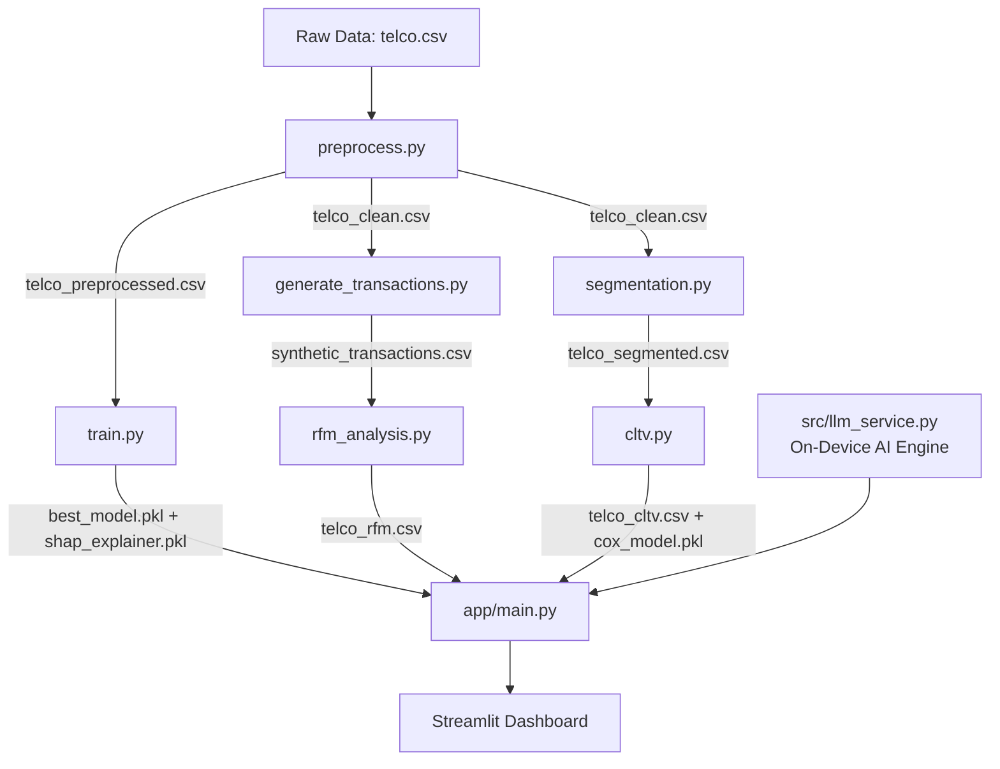

# ChurnGuard AI — Enterprise Customer Analytics Platform

[](http://localhost:8501)
[](https://python.org)
[](https://xgboost.readthedocs.io)
[](https://lifelines.readthedocs.io)
[](https://github.com/Anu2030/ChurnGuard_AI/actions)
[](./Dockerfile)
[](./src/llm_service.py)

An enterprise-grade, **AI-powered** customer intelligence platform built for subscription-based businesses (e.g., Telecom). The platform integrates machine learning classification, behavioral clustering, transaction-based RFM analysis, survival analysis, explainable AI (SHAP), and an on-device generative AI engine into a single premium Streamlit dashboard — **no API key required**.

---

## Executive Summary

In contractual businesses, customer acquisition costs significantly outweigh retention costs. This platform addresses profitability through six analytical pillars:

1. **Churn Prediction:** Upgraded ensemble evaluating Logistic Regression, Random Forest, XGBoost, and Gradient Boosting. The tuned model achieved a peak **Accuracy of 79.35%** (via Gradient Boosting) and a peak balanced **ROC-AUC of 0.8486** (via Logistic Regression) — catching over 8 out of every 10 churners.
2. **Behavioral Segmentation:** K-Means clustering (K=4, validated via Silhouette Score) maps customers into strategic personas with tailored retention playbooks.
3. **Predictive CLTV:** Cox Proportional Hazards survival model estimates individual expected remaining tenure, enabling forward-looking lifetime value projection.
4. **RFM Transaction Analytics:** Scores 7,043 customers across 231,710+ synthetic transactions into Champions, At Risk, Hibernating, and other behavioral buckets.
5. **Explainable AI:** SHAP (SHapley Additive exPlanations) breaks open the black box to explain exactly which features drive each individual prediction.
6. **On-Device AI Engine:** A local generative AI layer that powers predictive anomaly alerts, chart interpretation, a persistent copilot, and a dynamic natural-language report generator — all wrapped in a stunning Neon Cyberpunk UI.

---

## 🤖 AI-Powered Features

This platform includes a full suite of intelligent, on-device AI features built without any external API key:

### 🚨 Predictive Anomaly Feed
The Executive Summary tab opens with a live alert feed that automatically evaluates KPIs and flags critical business anomalies in real time, including churn rate threshold breaches, high-risk segment patterns, and revenue concentration warnings. Alerts are color-coded: **CRITICAL** (red), **WARNING** (amber), and **AI INSIGHT** (blue).

### 🤖 AI Chart Explanations ("Ask AI to Analyze")
Beneath key Plotly visualizations, interactive **"Ask AI to Analyze"** buttons provide deep, textual interpretations of what each chart is showing. Available on:
- **Customer Segmentation tab:** 3D cluster space analysis
- **CLTV & Survival tab:** Kaplan-Meier survival curve interpretation
- **CLTV & Survival tab:** CLTV distribution breakdown

### 💬 Persistent AI Copilot (Sidebar)
An always-on **AI Copilot** lives in the sidebar, accessible from every tab. Type any question about customer churn, CLTV, or retention strategy — the copilot responds with context-aware, data-driven insights regardless of which tab you are viewing.

### 🪄 AI Dynamic Report Generator (Tab 7)
Type a natural-language query like *"Show me a report on Fiber Optic users"* and the AI dynamically:
- Parses your intent to identify the target segment
- Filters the dataset to match
- Displays key segment KPIs (customer count, churn rate, avg CLTV, segment value)
- Synthesizes a custom Plotly chart
- Compiles and makes available a downloadable CSV of the segment

Pre-built quick chips for common queries are also available.

---

## System Architecture



---

## Model Performance

| Model | Accuracy | Precision | Recall | F1 | ROC-AUC |
|---|---|---|---|---|---|
| **Logistic Regression (Winner - AUC)** | 0.7374 | 0.5034 | **0.8021** | 0.6186 | **0.8486** |
| Random Forest | 0.7551 | 0.5259 | 0.7861 | 0.6302 | 0.8436 |
| **Gradient Boosting (Winner - Acc)** | **0.7935** | **0.6498** | 0.4813 | 0.5530 | 0.8451 |
| XGBoost | 0.7417 | 0.5084 | 0.8048 | 0.6232 | 0.8472 |

Logistic Regression was selected as the production model based on the highest balanced ROC-AUC (0.8486) and an excellent Recall (80.2%). Gradient Boosting is available for use cases prioritizing raw Accuracy (79.35%). New engineered features (`TenureInYears`, `ChargeRatio`) were added to improve performance.

---

## Methodology

### 1. Churn Classification (Risk Engine)
- **Models:** Logistic Regression (baseline), Random Forest, XGBoost
- **Tuning:** 3-fold stratified `GridSearchCV` — 72 fits for RF, 144 fits for XGBoost
- **Class Imbalance:** Dynamic `scale_pos_weight` in XGBoost penalizes missed churners
- **Explainability:** SHAP TreeExplainer generates per-customer feature importance

### 2. Behavioral Segmentation
K-Means on tenure, monthly charges, and total charges. Optimal K selected via Silhouette Score:

| Segment | Profile | Strategy |
|---|---|---|
| Loyal Premium | High tenure, high spend | Cross-sell premium add-ons |
| High-Spend At-Risk | Low tenure, high spend | Contract upgrade discounts |
| Loyal Value | High tenure, low spend | Reward longevity, roll-overs |
| New Budget | Low tenure, low spend | Onboarding nurture sequence |

### 3. Survival-Based CLTV
Traditional methods fail for active (right-censored) customers. The Cox Proportional Hazards model:
- Analyses how contract type, internet service, and payment method influence churn hazard
- Predicts individual conditional survival curves
- Integrates curves to estimate expected remaining tenure
- Computes CLTV = expected total tenure × monthly charges × profit margin

### 4. RFM Transaction Analytics
- Generates 231,710+ synthetic transactions across 7,043 customers
- Scores each customer on Recency, Frequency, and Monetary value (1–5 scale)
- Assigns strategic segments: Champions, Loyal Customers, Potential Loyalists, At Risk, Hibernating

### 5. On-Device AI Engine (`src/llm_service.py`)
A custom AI backend module that runs fully locally with no external API dependencies:
- `generate_executive_summary()` — Narrates KPIs as a professional board-level insight
- `generate_anomaly_alerts()` — Evaluates live metrics to surface critical anomalies
- `generate_chart_insight()` — Produces deep-dive textual analysis for specific chart types
- `generate_nba_email()` — Drafts hyper-personalized retention emails from SHAP features
- `chat_with_data()` — Conversational Q&A about churn patterns and strategy
- `parse_dynamic_report_query()` — Translates natural language into dataframe filters

---

## Dashboard Features

The Streamlit app provides seven interactive AI-powered workspaces:

| Tab | Contents |
|---|---|
| 📊 Executive Summary | 🚨 Predictive Anomaly Feed, KPI cards, churn driver charts |
| 🎯 Churn Risk Simulator | Real-time risk gauge, survival curve, SHAP waterfall, NBA engine, AI retention email |
| 👥 Customer Segmentation | Segment profiles, strategy cards, 3D PCA scatter, 🤖 AI cluster analysis |
| 📈 CLTV & Survival | 🤖 AI-analyzed Kaplan-Meier curves, CLTV distribution, 2×2 Risk-Value matrix |
| 🗂️ Batch CSV Scoring | Upload CSV, auto-score all customers, styled risk table, download results |
| 🛒 RFM Analytics | RFM KPI cards, interactive donut chart, color-coded customer table |
| 🪄 AI Report Generator | Natural-language segment queries, dynamic charts & tables, CSV export |

**Sidebar:** Persistent 💬 AI Copilot available on every tab.

---

## Installation & Setup

### Prerequisites
- Python 3.12+
- Git

### Quickstart

1. **Clone the repository:**
   ```bash
   git clone https://github.com/Anu2030/ChurnGuard_AI.git
   cd ChurnGuard_AI
   ```

2. **Create and activate virtual environment:**
   ```bash
   python -m venv venv
   # Windows:
   venv\Scripts\activate
   # macOS/Linux:
   source venv/bin/activate
   ```

3. **Install dependencies:**
   ```bash
   pip install -r requirements.txt
   ```

4. **Run the pipeline (in order):**
   ```bash
   python src/preprocess.py
   python src/train.py
   python src/segmentation.py
   python src/cltv.py
   python src/generate_transactions.py
   python src/rfm_analysis.py
   ```

5. **Launch the dashboard:**
   ```bash
   streamlit run app/main.py
   ```
   The browser will open automatically at [http://localhost:8501](http://localhost:8501).

> **No API key required.** All AI features run on-device via `src/llm_service.py`.

---

## Key Business Insights

- **The Contract Effect:** Month-to-month customers have a **7.4x higher churn hazard** than Two-year contract holders — contract upgrade campaigns are the single highest-ROI retention action.
- **Service Friction:** Fiber Optic customers show a significantly elevated hazard rate (Cox coef: +0.486). Investigating pricing and service quality for this segment is a priority recommendation.
- **VIP at Risk:** High-CLTV, high-churn-risk customers are the most important segment — they represent maximum revenue at risk and warrant dedicated account manager outreach.
- **Electronic Check Risk:** Customers paying by Electronic Check have a 68% higher churn hazard than those on automatic payments, making payment method conversion a low-effort, high-impact lever.
- **Loyal Premium Value Concentration:** The Loyal Premium cohort (2+ years tenure) represents ~40% of total CLTV but only ~15% of the customer base — protecting this cohort is the highest-priority retention objective.

---

## MLOps & Software Engineering

### Automated Tests

```bash
pytest tests/ -v
```

The `tests/` suite covers:
- `test_preprocess.py` — Validates `clean_data`: blank `TotalCharges` handling, NaN filling, `SeniorCitizen` mapping, `customerID` preservation.
- `test_config.py` — Validates configuration paths, hyperparameter grid structure, and feature list integrity.

**All 8 tests pass locally.**

### CI/CD with GitHub Actions

`.github/workflows/ci.yml` triggers automatically on every push or pull request to `main`:

1. Spins up Ubuntu with Python 3.12
2. Installs all dependencies from `requirements.txt`
3. Runs `flake8` (syntax + undefined name checks)
4. Runs the full `pytest` suite

### Docker Deployment

```bash
# Build image
docker build -t churnguard-ai .

# Run container
docker run -p 8501:8501 churnguard-ai
```

App available at `http://localhost:8501`. The `.dockerignore` excludes `venv/`, `__pycache__`, and dev tooling from the image.

---

## Tech Stack

| Layer | Technology |
|---|---|
| ML Models | XGBoost, Scikit-learn (LR, RF, K-Means, PCA) |
| Survival Analysis | Lifelines (Cox PH, Kaplan-Meier) |
| Explainability | SHAP (TreeExplainer) |
| On-Device AI | Custom `llm_service.py` engine (no API key) |
| Dashboard | Streamlit + Plotly |
| MLOps | Docker, GitHub Actions CI/CD, pytest, flake8 |
| Data | Python 3.12, Pandas, NumPy, Joblib |
