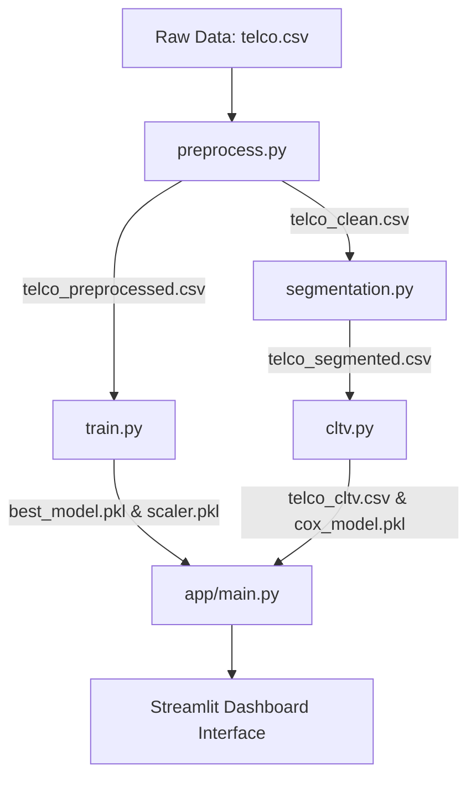

# End-to-End Customer Analytics: Churn Prediction, Behavioral Segmentation, & CLTV Survival Modeling

[](http://localhost:8501)
[](https://python.org)
[](https://scikit-learn.org)
[](https://xgboost.readthedocs.io)
[](https://lifelines.readthedocs.io)

An enterprise-grade customer intelligence platform built for contractual subscription settings (e.g., Telecom). This project integrates machine learning classification, behavioral clustering, and survival analysis to predict customer churn, segment user personas, project future lifetime value (CLTV), and design data-driven retention playbooks.

---

## 📌 Executive Summary & Business Impact

In contractual businesses, customer acquisition is highly expensive. Maximizing customer retention and optimizing marketing budgets is the primary driver of profitability. This platform addresses these goals using three analytical pillars:

1. **Churn Prediction (Risk Engine):** Classifies customers by churn risk using an **XGBoost** model (optimized via GridSearchCV, achieving **ROC-AUC: 0.8449**).
2. **Behavioral Segmentation (Engagement Personas):** Clusters customers into 4 strategic groups using **K-Means Clustering** based on their tenure and spend dynamics.
3. **CLTV Modeling (Survival Analysis):** Replaces naive historical value calculations with a **Cox Proportional Hazards Model** from `lifelines` to estimate active customers' expected remaining tenure and compute predictive Customer Lifetime Value (CLTV).
4. **Interactive Command Center:** A premium **Streamlit** dashboard that aggregates KPI metrics, houses a real-time risk simulator, provides a 3D PCA cluster visualizer, and maps users into a 2x2 Risk-Value Matrix to automate budget allocations.

---

## 🛠️ System Architecture & Workflow



---

## 🧪 Methodology & Modeling

### 1. Risk Engine (Churn Classification)
We train and compare three machine learning models: **Logistic Regression** (baseline), **Random Forest**, and **XGBoost**.
- **Preprocessing:** Categorical encoding (one-hot encoding), handling missing values (coercing `TotalCharges` to numeric), and standard scaling numeric columns.
- **Tuning:** Stratified train-test split (80/20) to preserve churn balance, followed by 3-fold cross-validation grid search (`GridSearchCV`) for hyperparameter optimization.
- **Best Model:** XGBoost (`learning_rate=0.1`, `max_depth=3`, `n_estimators=100`) outperformed other models with a test set **ROC-AUC of 0.8449**.

### 2. Behavioral Personas (Segmentation)
Using K-Means Clustering on scaled `tenure`, `MonthlyCharges`, and `TotalCharges` behavior, we partition customers into 4 distinct profiles:
- **Loyal Premium:** Long-standing customers with high monthly charges (VIPs).
- **Loyal Value:** Long-standing customers with budget-conscious charges (Stable).
- **High-Spend At-Risk:** Short-tenure customers with high monthly charges (New fiber-optic users).
- **New Budget:** Short-tenure customers with low monthly charges (Trials).

### 3. Predictive CLTV (Survival Analysis)
Traditional transaction models (like BG/NBD) fail in subscription settings. We implement **Survival Analysis** to handle "right-censored" active customers (customers who haven't churned yet):
- **Cox Proportional Hazards Model:** Analyzes how covariates (e.g., contract types, internet services) influence the hazard (risk) of churn over time.
- **Expected Remaining Tenure:** For active customers, we predict their individual conditional survival curves and integrate them up to 72 months to estimate remaining months:
  $$\text{Expected Remaining Months} = \sum_{t = T_i + 1}^{72} \frac{S_i(t)}{S_i(T_i)}$$
- **CLTV Calculation:** Computed using expected total tenure, monthly charges, and a realistic telecom gross profit margin (70%):
  $$\text{CLTV}_i = (\text{Current Tenure}_i + \text{Expected Remaining Months}_i) \times \text{Monthly Charges}_i \times 0.70$$

---

## 🖥️ Interactive Dashboard Features

The Streamlit application provides four main workspaces:
1. **Executive Overview & EDA:** High-level metrics (Overall Churn Rate, Average CLTV, Active Revenue Portfolio) alongside interactive Plotly charts highlighting critical churn drivers.
2. **Churn Risk Simulator:** Enables users to modify slider and selection inputs for a customer and dynamically computes their churn probability (gauge chart), lifetime value, and plots their real-time survival decay curve.
3. **Behavioral Clustering Tab:** Contains profile metric tables, strategic marketing recommendations, and an interactive **3D PCA scatter plot** projecting customer profiles.
4. **CLTV & Strategy Dashboard:** Shows baseline Kaplan-Meier curves comparing cohort decay by contract type and divides the customer base into a **2x2 Risk-Value Matrix** ("VIP at Risk", "VIP Loyal", "Low-Value Churner", "Stable Budget") to target resources efficiently.

---

## 🚀 Installation & Running Guide

### Prerequisites
- Python 3.12 (Recommended)
- Windows / macOS / Linux

### Setup Instructions

1. **Clone the Repository:**
   ```bash
   git clone https://github.com/<your-username>/churn_cltv.git
   cd churn_cltv
   ```

2. **Initialize and Activate Virtual Environment:**
   ```bash
   python -m venv venv
   # On Windows:
   venv\Scripts\activate
   # On macOS/Linux:
   source venv/bin/activate
   ```

3. **Install Dependencies:**
   ```bash
   pip install -r requirements.txt
   ```

4. **Execute Pipeline Scripts (Sequentially):**
   ```bash
   # Step 1: Preprocess and clean raw data
   python src/preprocess.py
   
   # Step 2: Run GridSearchCV and train classification models
   python src/train.py
   
   # Step 3: Run K-Means and segment customers
   python src/segmentation.py
   
   # Step 4: Perform survival analysis and CLTV projections
   python src/cltv.py
   ```

5. **Run the Streamlit Dashboard:**
   ```bash
   streamlit run app/main.py
   ```
   *Your browser will automatically open [http://localhost:8501](http://localhost:8501) showing the platform.*

---

## 📈 Key Insights & Retention Playbook

- **The Contract Effect:** Customers on a **Month-to-month** contract have a **7.4x higher risk of churning** compared to customers on a Two-year contract, making contract conversion programs highly lucrative.
- **Service Friction:** Customers with **Fiber Optic** internet service have a significantly elevated hazard rate. Investigating service stability or pricing structures for fiber is a key recommendation.
- **VIP at Risk Bucket:** Accounts for high revenue but presents elevated churn probability. The playbook recommends prioritizing direct support outreach and offering contract upgrade incentives to secure these accounts.
