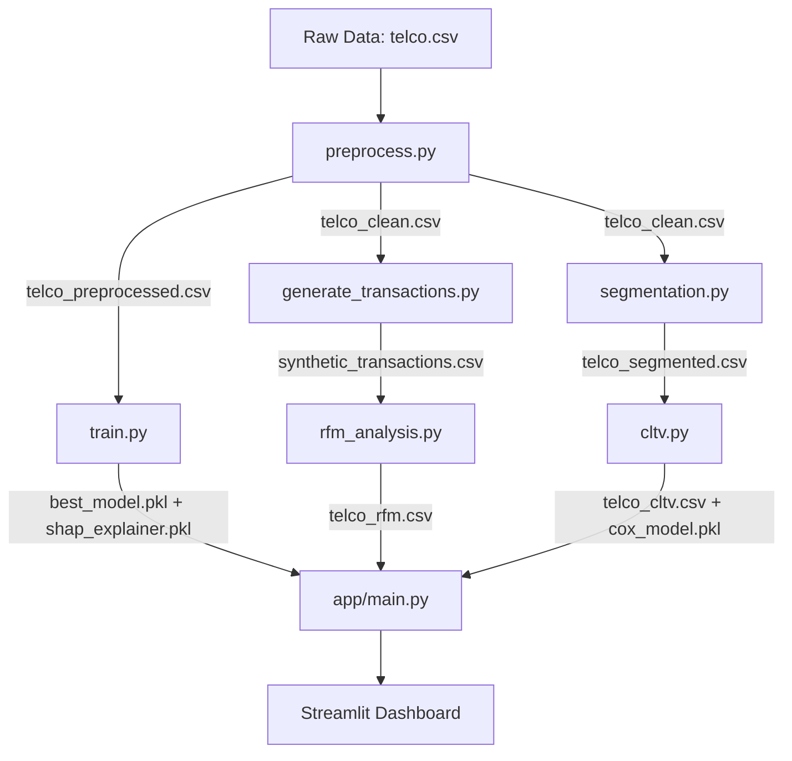

# ChurnGuard AI — End-to-End Customer Analytics Platform

[](http://localhost:8501)
[](https://python.org)
[](https://xgboost.readthedocs.io)
[](https://lifelines.readthedocs.io)
[](https://github.com/Anu2030/ChurnGuard_AI/actions)
[](./Dockerfile)

An enterprise-grade customer intelligence platform built for subscription-based businesses (e.g., Telecom). The platform integrates machine learning classification, behavioral clustering, transaction-based RFM analysis, survival analysis, and explainable AI (SHAP) into a single premium Streamlit dashboard.

---

## Executive Summary

In contractual businesses, customer acquisition costs significantly outweigh retention costs. This platform addresses profitability through five analytical pillars:

1. **Churn Prediction:** XGBoost classifier with GridSearchCV tuning achieving **ROC-AUC 0.8444** and **Recall 79.7%** — catching nearly 8 out of every 10 churners.
2. **Behavioral Segmentation:** K-Means clustering (K=4, validated via Silhouette Score) maps customers into strategic personas with tailored retention playbooks.
3. **Predictive CLTV:** Cox Proportional Hazards survival model estimates individual expected remaining tenure, enabling forward-looking lifetime value projection.
4. **RFM Transaction Analytics:** Scores 7,043 customers across 231,710+ synthetic transactions into Champions, At Risk, Hibernating, and other behavioral buckets.
5. **Explainable AI:** SHAP (SHapley Additive exPlanations) breaks open the XGBoost black box to explain exactly which features drive each individual prediction.

---

## System Architecture



---

## Model Performance

| Model | Accuracy | Precision | Recall | F1 | ROC-AUC |
|---|---|---|---|---|---|
| Logistic Regression | 0.7381 | 0.5043 | 0.7834 | 0.6136 | 0.8418 |
| Random Forest | 0.7587 | 0.5311 | 0.7754 | 0.6304 | 0.8426 |
| **XGBoost (Winner)** | **0.7360** | **0.5017** | **0.7968** | **0.6157** | **0.8444** |

XGBoost was selected as the production model based on highest ROC-AUC. High recall (79.7%) is prioritised over raw accuracy since missing a churner is more costly than a false alarm.

---

## Methodology

### 1. Churn Classification (Risk Engine)
- **Models:** Logistic Regression (baseline), Random Forest, XGBoost
- **Tuning:** 3-fold stratified `GridSearchCV` — 72 fits for RF, 144 fits for XGBoost
- **Class Imbalance:** Dynamic `scale_pos_weight` in XGBoost penalizes missed churners
- **Explainability:** SHAP TreeExplainer generates per-customer feature importance

### 2. Behavioral Segmentation
K-Means on tenure, monthly charges, and total charges. Optimal K selected via Silhouette Score:

| Segment | Profile | Strategy |
|---|---|---|
| Loyal Premium | High tenure, high spend | Cross-sell premium add-ons |
| High-Spend At-Risk | Low tenure, high spend | Contract upgrade discounts |
| Loyal Value | High tenure, low spend | Reward longevity, roll-overs |
| New Budget | Low tenure, low spend | Onboarding nurture sequence |

### 3. Survival-Based CLTV
Traditional methods fail for active (right-censored) customers. The Cox Proportional Hazards model:
- Analyses how contract type, internet service, and payment method influence churn hazard
- Predicts individual conditional survival curves
- Integrates curves to estimate expected remaining tenure
- Computes CLTV = expected total tenure × monthly charges × profit margin

### 4. RFM Transaction Analytics
- Generates 231,710+ synthetic transactions across 7,043 customers
- Scores each customer on Recency, Frequency, and Monetary value (1–5 scale)
- Assigns strategic segments: Champions, Loyal Customers, Potential Loyalists, At Risk, Hibernating

---

## Dashboard Features

The Streamlit app provides six interactive workspaces:

| Tab | Contents |
|---|---|
| Executive Summary | KPI cards, churn driver charts (contract, charges, payment method) |
| Churn Risk Simulator | Real-time risk gauge, survival curve, SHAP explanation, Next Best Action |
| Customer Segmentation | Segment profiles, strategy cards, interactive 3D PCA scatter plot |
| CLTV & Survival | Kaplan-Meier cohort curves, CLTV distribution, 2x2 Risk-Value matrix |
| Batch CSV Scoring | Upload CSV, auto-score all customers, download results |
| RFM Analytics | RFM KPI cards, interactive donut chart, segment strategy playbook |

---

## Installation & Setup

### Prerequisites
- Python 3.12
- Git

### Quickstart

1. **Clone the repository:**
   ```bash
   git clone https://github.com/Anu2030/ChurnGuard_AI.git
   cd ChurnGuard_AI
   ```

2. **Create and activate virtual environment:**
   ```bash
   python -m venv venv
   # Windows:
   venv\Scripts\activate
   # macOS/Linux:
   source venv/bin/activate
   ```

3. **Install dependencies:**
   ```bash
   pip install -r requirements.txt
   ```

4. **Run the pipeline (in order):**
   ```bash
   python src/preprocess.py
   python src/train.py
   python src/segmentation.py
   python src/cltv.py
   python src/generate_transactions.py
   python src/rfm_analysis.py
   ```

5. **Launch the dashboard:**
   ```bash
   streamlit run app/main.py
   ```
   The browser will open automatically at [http://localhost:8501](http://localhost:8501).

---

## Key Business Insights

- **The Contract Effect:** Month-to-month customers have a **7.4x higher churn hazard** than Two-year contract holders — contract upgrade campaigns are the single highest-ROI retention action.
- **Service Friction:** Fiber Optic customers show a significantly elevated hazard rate (Cox coef: +0.486). Investigating pricing and service quality for this segment is a priority recommendation.
- **VIP at Risk:** High-CLTV, high-churn-risk customers are the most important segment — they represent maximum revenue at risk and warrant dedicated account manager outreach.
- **Electronic Check Risk:** Customers paying by Electronic Check have a 68% higher churn hazard than those on automatic payments, making payment method conversion a low-effort, high-impact lever.

---

## MLOps & Software Engineering

### Automated Tests

```bash
pytest tests/ -v
```

The `tests/` suite covers:
- `test_preprocess.py` — Validates `clean_data`: blank `TotalCharges` handling, NaN filling, `SeniorCitizen` mapping, `customerID` preservation.
- `test_config.py` — Validates configuration paths, hyperparameter grid structure, and feature list integrity.

**All 8 tests pass locally.**

### CI/CD with GitHub Actions

`.github/workflows/ci.yml` triggers automatically on every push or pull request to `main`:

1. Spins up Ubuntu with Python 3.12
2. Installs all dependencies from `requirements.txt`
3. Runs `flake8` (syntax + undefined name checks)
4. Runs the full `pytest` suite

### Docker Deployment

```bash
# Build image
docker build -t churnguard-ai .

# Run container
docker run -p 8501:8501 churnguard-ai
```

App available at `http://localhost:8501`. The `.dockerignore` excludes `venv/`, `__pycache__`, and dev tooling from the image.

---

## Tech Stack

| Layer | Technology |
|---|---|
| ML Models | XGBoost, Scikit-learn (LR, RF, K-Means, PCA) |
| Survival Analysis | Lifelines (Cox PH, Kaplan-Meier) |
| Explainability | SHAP (TreeExplainer) |
| Dashboard | Streamlit + Plotly |
| MLOps | Docker, GitHub Actions CI/CD, pytest, flake8 |
| Data | Python 3.12, Pandas, NumPy, Joblib |
