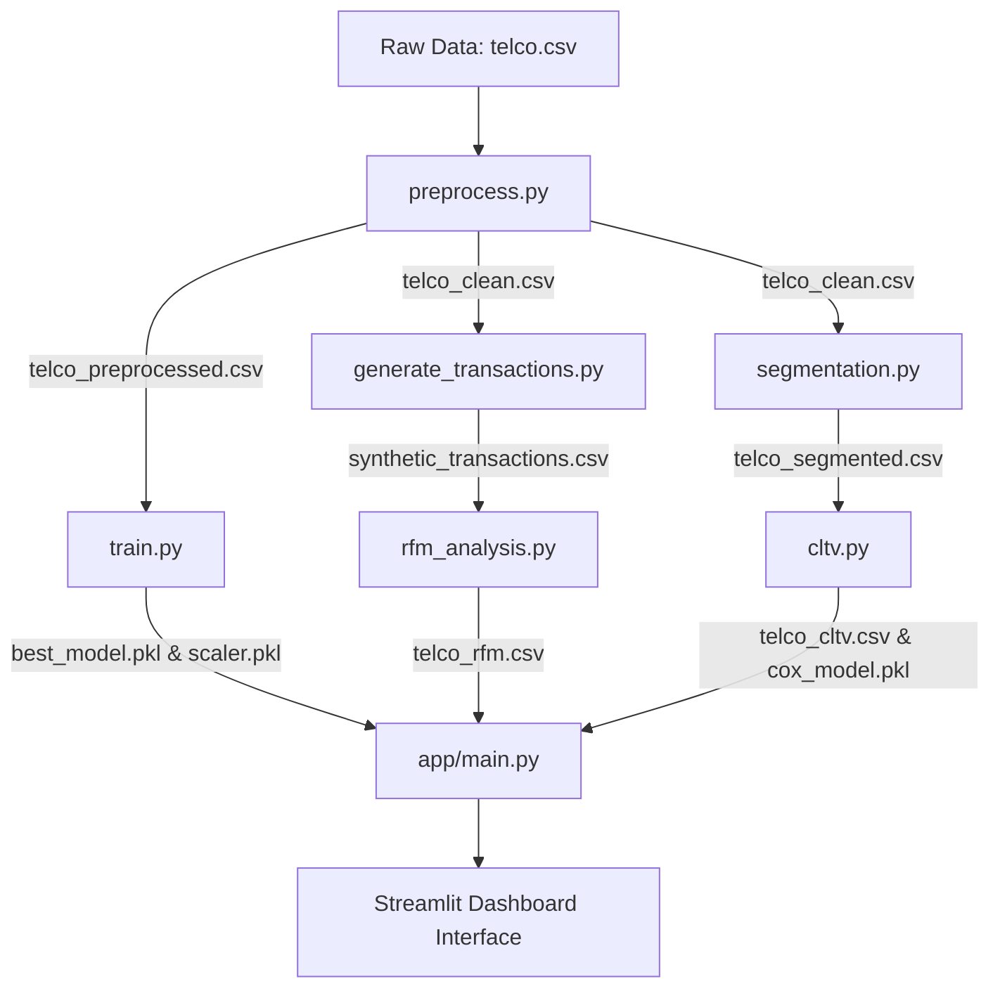

# End-to-End Customer Analytics: Churn Prediction, Behavioral Segmentation, & CLTV Survival Modeling

[](http://localhost:8501)
[](https://python.org)
[](https://scikit-learn.org)
[](https://xgboost.readthedocs.io)
[](https://lifelines.readthedocs.io)

An enterprise-grade customer intelligence platform built for contractual subscription settings (e.g., Telecom). This project integrates machine learning classification, behavioral clustering, transaction-based RFM analysis, and survival analysis to predict customer churn, segment user personas, project future lifetime value (CLTV), and design data-driven retention playbooks.

---

## Executive Summary & Business Impact

In contractual businesses, customer acquisition is highly expensive. Maximizing customer retention and optimizing marketing budgets is the primary driver of profitability. This platform addresses these goals using four analytical pillars:

1. **Churn Prediction (Risk Engine):** Classifies customers by churn risk using an **XGBoost** model (optimized via GridSearchCV, achieving **ROC-AUC: 0.8449**). Includes class weight balancing to penalize missed churners.
2. **Behavioral Segmentation (Engagement Personas):** Clusters customers into 4 strategic groups using **K-Means Clustering** (validated via Silhouette Score) based on their tenure, spend dynamics, and categorical behaviors.
3. **RFM Transaction Analytics:** Generates and analyzes transaction histories to rank customers via Recency, Frequency, and Monetary value, mapping them to actionable buckets (e.g., Champions, At Risk).
4. **CLTV Modeling (Survival Analysis):** Replaces naive historical value calculations with a **Cox Proportional Hazards Model** from `lifelines` to estimate active customers' expected remaining tenure and compute predictive Customer Lifetime Value (CLTV).
5. **Interactive Command Center:** A premium **Streamlit** dashboard featuring real-time risk simulation, dynamic profit margin adjustments, batch CSV bulk scoring, 3D PCA cluster visualization, and 2x2 Risk-Value strategy matrices.

---

## System Architecture & Workflow



---

## Methodology & Modeling

### 1. Risk Engine (Churn Classification)
We train and compare three machine learning models: **Logistic Regression** (baseline), **Random Forest**, and **XGBoost**.
- **Preprocessing:** Categorical encoding (one-hot encoding), handling missing values (coercing `TotalCharges` to numeric), and standard scaling numeric columns.
- **Tuning:** Stratified train-test split (80/20) to preserve churn balance, followed by deep 3-fold cross-validation grid search (`GridSearchCV`) for hyperparameter optimization.
- **Handling Imbalance:** The XGBoost model dynamically calculates and applies `scale_pos_weight` to address class imbalances.

### 2. Behavioral Personas (Segmentation)
Using K-Means Clustering on scaled continuous and one-hot encoded categorical features, we partition customers into 4 distinct profiles:
- **Loyal Premium:** Long-standing customers with high monthly charges (VIPs).
- **Loyal Value:** Long-standing customers with budget-conscious charges (Stable).
- **High-Spend At-Risk:** Short-tenure customers with high monthly charges (New fiber-optic users).
- **New Budget:** Short-tenure customers with low monthly charges (Trials).

### 3. Predictive CLTV (Survival Analysis)
Traditional transaction models (like BG/NBD) fail in subscription settings. We implement **Survival Analysis** to handle "right-censored" active customers (customers who haven't churned yet):
- **Cox Proportional Hazards Model:** Analyzes how covariates (e.g., contract types, internet services) influence the hazard (risk) of churn over time.
- **Expected Remaining Tenure:** For active customers, we predict their individual conditional survival curves and integrate them up to 72 months to estimate remaining months.
- **CLTV Calculation:** Computed using expected total tenure, monthly charges, and a realistic telecom gross profit margin (adjustable in UI).

### 4. RFM Transaction Analytics
- **Recency, Frequency, Monetary:** Simulates and scores customer transaction history using pandas quantiles (`qcut`) to rank them from 1 to 5.
- **Strategic Segments:** Combines the R-F-M scores to automatically drop customers into proven marketing segments (Champions, Loyal Customers, Potential Loyalists, At Risk, Hibernating).

---

## Interactive Dashboard Features

The Streamlit application provides six main workspaces:
1. **Executive Overview & EDA:** High-level metrics and an active revenue portfolio alongside interactive Plotly charts highlighting critical churn drivers.
2. **Churn Risk Simulator:** Enables users to modify slider inputs and dynamically computes churn probability (gauge chart), lifetime value, and plots a real-time survival decay curve. Includes an adjustable Profit Margin slider.
3. **Customer Segmentation Tab:** Contains profile metric tables, strategic marketing recommendations, and an interactive **3D PCA scatter plot**.
4. **CLTV & Strategy Dashboard:** Shows baseline Kaplan-Meier curves and divides the customer base into a **2x2 Risk-Value Matrix** to target resources efficiently.
5. **Batch CSV Scoring:** Upload a raw `.csv` of customer data to automatically clean it, scale it, generate predictive churn risks, and download the fully scored output.
6. **RFM Transaction Analytics:** Interactive Donut Chart visualizing the breakdown of the customer base into strategic RFM buckets with corresponding marketing playbooks.

---

## Installation & Running Guide

### Prerequisites
- Python 3.12 (Recommended)
- Windows / macOS / Linux

### Setup Instructions

1. **Clone the Repository:**
   ```bash
   git clone https://github.com/<your-username>/churn_cltv.git
   cd churn_cltv
   ```

2. **Initialize and Activate Virtual Environment:**
   ```bash
   python -m venv venv
   # On Windows:
   venv\Scripts\activate
   # On macOS/Linux:
   source venv/bin/activate
   ```

3. **Install Dependencies:**
   ```bash
   pip install -r requirements.txt
   ```

4. **Execute Pipeline Scripts (Sequentially):**
   ```bash
   # Step 1: Preprocess and clean raw data
   python src/preprocess.py
   
   # Step 2: Run GridSearchCV and train classification models
   python src/train.py
   
   # Step 3: Run K-Means and segment customers
   python src/segmentation.py
   
   # Step 4: Perform survival analysis and CLTV projections
   python src/cltv.py

   # Step 5: Generate and analyze RFM transactions
   python src/generate_transactions.py
   python src/rfm_analysis.py
   ```

5. **Run the Streamlit Dashboard:**
   ```bash
   streamlit run app/main.py
   ```
   *Your browser will automatically open [http://localhost:8501](http://localhost:8501) showing the platform.*

---

## Key Insights & Retention Playbook

- **The Contract Effect:** Customers on a **Month-to-month** contract have a **7.4x higher risk of churning** compared to customers on a Two-year contract, making contract conversion programs highly lucrative.
- **Service Friction:** Customers with **Fiber Optic** internet service have a significantly elevated hazard rate. Investigating service stability or pricing structures for fiber is a key recommendation.
- **VIP at Risk Bucket:** Accounts for high revenue but presents elevated churn probability. The playbook recommends prioritizing direct support outreach and offering contract upgrade incentives to secure these accounts.

---

## MLOps & Software Engineering

### Running Automated Tests

The `tests/` directory contains a `pytest` test suite that validates core data processing logic.

```bash
pytest tests/ -v
```

The suite covers:
- `test_preprocess.py` — Validates that `clean_data` correctly handles blank `TotalCharges`, properly fills NaN values, maps `SeniorCitizen` integers, and preserves `customerID`.
- `test_config.py` — Ensures all configuration paths, hyperparameter grids, and feature lists are structurally valid.

### CI/CD with GitHub Actions

A continuous integration pipeline is configured at `.github/workflows/ci.yml`. It runs automatically on every push or pull request to `main`. The pipeline:

1. Spins up an Ubuntu environment with Python 3.12.
2. Installs all dependencies from `requirements.txt`.
3. Runs `flake8` to check for syntax errors and undefined names in `src/`, `app/`, and `tests/`.
4. Runs the full `pytest` test suite to ensure no regressions.

### Docker Deployment

The application can be containerized and deployed anywhere using Docker.

```bash
# Build the Docker image
docker build -t churnguard-ai .

# Run the container
docker run -p 8501:8501 churnguard-ai
```

The app will be available at `http://localhost:8501`.

The `.dockerignore` file ensures the image stays lean by excluding local virtual environments, `__pycache__`, and development tooling from the build context.

